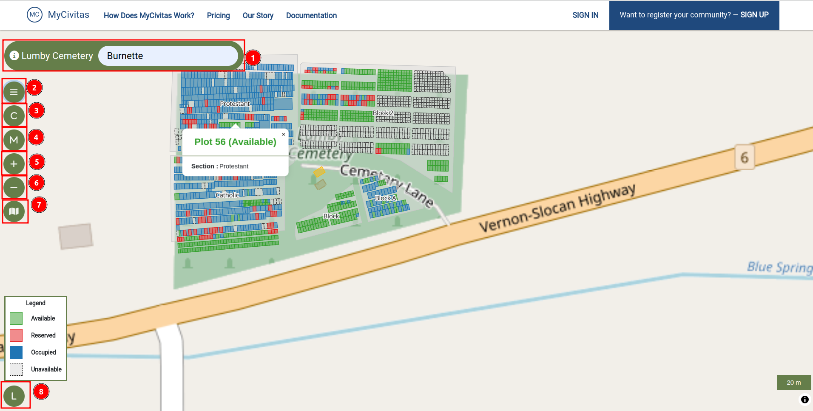
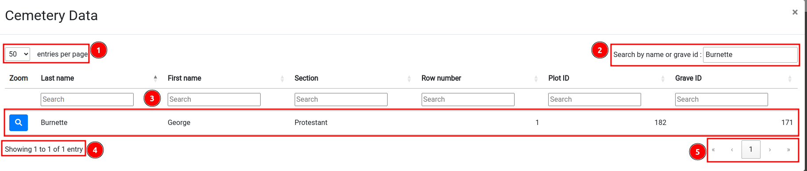
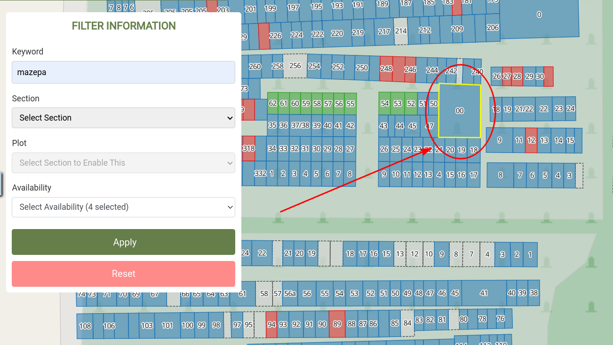
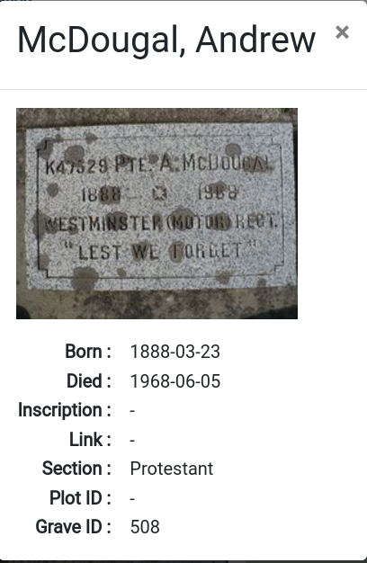

# Map Page: Mycivitas Cemetery

The map interface provides several features to help you navigate and interact with the map effectively. The 1️⃣ `Search Box` allows you to search for a specific person by their name or locate a grave using its ID. To refine search results, you can click on the 2️⃣ `Show Filter List` and apply various filters, such as section or plot availability. The 3️⃣ `Toggle Columbarium` and 4️⃣ `Toggle Memorial Wall` options enable you to display memorial wall data. For navigation, you can utilise the 5️⃣ `Zoom In` and 6️⃣ `Zoom Out` buttons to adjust the map's scale for a closer or broader view. The 7️⃣ `Switch Base Layer` feature allows you to change the map's visual perspective, such as switching between satellite view and standard map view. Finally, the 8️⃣ `Legend` provides an explanation of the map's colour codes and symbols, helping you understand plot statuses, sections, and other details effectively.

## How to search grave?

You can search for any grave by entering the person's name or grave ID in the 1️⃣ `Search Box`. Simply type the name or grave ID and press the Enter key to view the results.

When you search for a grave, a pop-up window displays the results along with various features to refine and navigate through the information. The 1️⃣ `Entries per page` option allows you to select how many results you want to view on each page, while the 2️⃣ `Search by name or grave id` field enables you to refine the search further by entering a specific name. The 3️⃣ `Grave Details` section provides detailed information about the graves matching your search criteria, such as the name and ID. Additionally, the 4️⃣ `Showing X to Y of Z entries` indicator shows the range of entries currently visible and the total number of results. For easier navigation, the 5️⃣ `Pagination` feature lets you move between pages of search results and view the current page number. You can use `x` button at the top right corner to close the pop-up window.

## How to filter data?

You can filter data by selecting the 1️⃣ `Show Filter List` option, which opens a `FILTER INFORMATION` form containing several options to refine your search. To narrow down results, you can enter a specific name or grave ID in the 2️⃣ `Keyword` field. The 3️⃣ `Section` dropdown menu allows you to select a particular section to focus on, while the 4️⃣ `Plot` dropdown menu enables you to view a specific plot. To filter by availability, use the 5️⃣ `Availability` dropdown menu. Once you have selected your desired filters, click the 6️⃣ `Apply` button to apply them. If you wish to clear all filters and start fresh, use the 7️⃣ `Reset` button to restore the default settings.    

After applying the filter, the matched area on the map will be highlighted, as shown in the image below. This visual cue helps you quickly identify the relevant sections or plots that match your search criteria, making it easier to navigate and analyse the map.

## How to switch base layer?

To change the map's visual perspective, you can use the 1️⃣ `Switch Base Layer` feature. Hover over the 2️⃣ `Map`, which will reveal the 3️⃣ `Available Base Layers`. From here, you can switch between the different base layers by clicking on the desired option, allowing you to customise the map's appearance to suit your needs.

## How to view legend?

To view the legend, click on the 1️⃣ `L` symbol located at the bottom left corner of the page. This will open the 2️⃣ `Legend`, which explains the meaning of the colours used on the map.

* **Available:** The green colour on the map indicates that the plot is available to be a grave.

* **Reserved:** The red colour on the map indicates that the plot is reserved to be a grave.

* **Occupied:** The blue colour on the map indicates that the plot is occupied.

* **Unavailable:** The white colour on the map indicates that the plot is unavailable.

## How to inspect grave?

To inspect the grave click on the 1️⃣ `Grave` on the map. This will open a 2️⃣ `Pop-up` window with the grave details.

To view the grave details, click on the 1️⃣ `Details`. This will open a pop-up window.

The pop-up window displays information about the person buried in the grave. It includes details such as their name, grave ID, and other relevant information.

