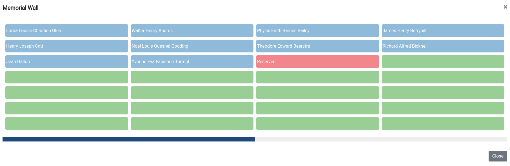
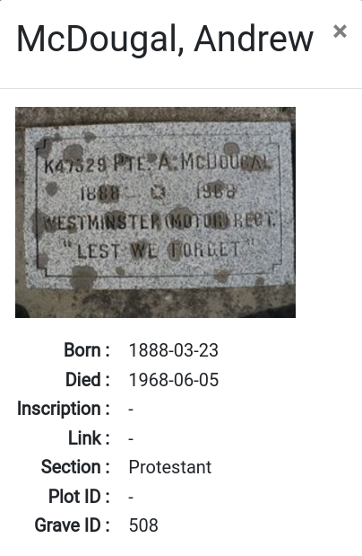

# Map Page: Mycivitas Cemetery

1. **Search Box:** Users can search for any location on the map by entering a person's name or grave ID in the search box.

    For example , searching for `Burnette` will display the location of Burnette's grave on the map.

    

    1 **Cemetery Data:** Label of the pop-up window.

    2 **Entries per page:** Allows users to select the number of entries to display per page.

    3 **Search:** Allows users to search for a specific name or grave ID.

    4 **x:** Allows users to close the pop-up window.

    5 **Result:** The search results display details such as the first name, last name, section, row, plot ID, and grave ID.

    6 **Showing 1 to 1 of 1 entry:** Displays the number of entries displayed on the current page.

    7 **Pagination:** Enables seamless navigation through search result pages while displaying the current page number.

2. **Show Filter List:** Users can filter the information by using the filter list.

    

    * **Keyword:** Allows users to filter the information by entering name or grave ID.

    * **Section:** Allows users to filter the information by selecting a specific section.

    * **Plot:** Allows users to filter the information by selecting a specific plot.

    * **Availability:** Allows users to filter the information by selecting a specific availability.

    * **Apply:** Applies the selected filters.

    * **Reset:** Resets all filters.

3. **Toggle Columbarium:** Users can toggle the visibility of the Columbarium.

    

    * **x:** Allows users to close the pop-up window.

    * **Close:** Allows users to close the pop-up window.
    
4. **Toggle Memorial Wall:** Users can toggle the visibility of the Memorial Wall.

    

5. **Zoom In:** Allows users to zoom in on the map.

6. **Zoom Out:** Allows users to zoom out on the map.

7. **Switch Base Layer:** Allows users to switch between different base layers.

8. **Legend:** Displays the legend for the map.

    

    * **Available:** The green color represents that this plot is available to be a grave. 

    * **Reserved:** The red color represents that this plot is reserved.

    * **Occupied:** The blue color represents that this plot is occupied.

    * **White:** The white color represents that this plot is not available.

## Inspect Grave

Users can inspect a grave by clicking on it. This reveals the plot number, current status of the grave, and the associated person's details.

* Click on the person's name to view their details. This action opens a new window displaying the person's information, including their name, birth date, death date, inscription, link, section, plot, and grave ID.

    

    * **x:** Close the window.
    